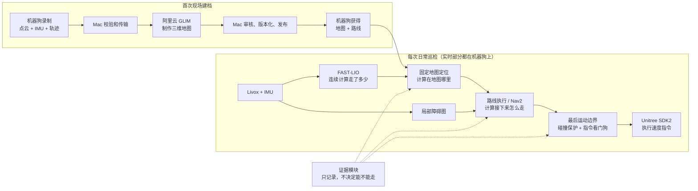
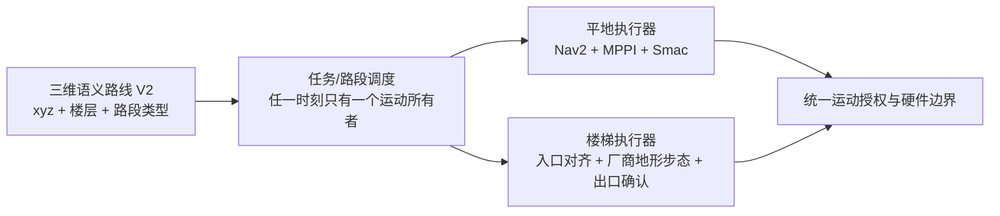

# GoGoGuard 巡检系统技术路线总说明

> 更新日期：2026-08-10
>
> 阅读对象：产品负责人、现场人员和后续 Codex 任务
> 本文解决“整体在做什么、每种能力由谁提供、哪些已经可用、哪些还只是方案”。实时部署参数、最新现场证据和故障细节仍以 [PROJECT_STATE.md](../PROJECT_STATE.md) 为准。

## 先说结论

之前的“解耦和模块化”没有白做，它解决了代码应该放在哪里、谁拥有哪个责任、部署是谁的事这类开发问题。现在依然是一个模块化单仓库，不是又退回到了一个大文件。

现在难懂，主要不是你没有认真读，而是资料结构少了一层：

- `AGENTS.md` 和模块索引是给 Codex 找代码负责人的，不是给产品负责人理解巡检的。
- `PROJECT_STATE.md` 同时记录了产品现状、部署回执和大量现场故障。它权威，但不适合当入门说明书。
- “成熟算法”和“我们自己写的恢复/编排逻辑”没有在讲解中分开。现场问题恰恰经常发生在后者。
- 建图、定位、路线、导航、避障、安全和证据是不同能力，但过去经常用“导航问题”一句话包了起来。

这份文档是从现场场景到技术的主入口。以后讨论一个故障时，先说它属于哪个能力，再说对应算法和模块，不再直接从一个现象跳到一个算法名字。

## 我们真正要交付的是什么

目标不是“让 Nav2 动起来”，而是一个能重复完成的巡检任务：

1. 首次到现场时，用人工遥控录制环境，生成并审核一份三维地图。
2. 在地图上定义一条可执行的巡检路线，包括平地、转弯、窄口、楼梯和巡检点。
3. 机器狗开机后知道自己在地图中的位置，并在运动中持续保持该位置可信。
4. 按路线行走；人临时走过时等待或绕行，通路变化时寻找可通侧路，障碍消失后自动继续。
5. 到达巡检点后执行拍照、视频或其他检查动作，然后继续下一段。
6. 最终产生一份可追溯的巡检结果：走了哪里、停过几次、为什么停、每个点检查了什么。

当前第 1 到第 4 步已有真机运行基础，最新 V6 路线已获得操作员发版认可。实时音视频已经在独立真机试验中跑通，正式 `interaction` 模块也已合并，但尚未与本版导航做并发部署验收。巡检点动作和任务编排现在有离线合同、状态机和证据缓存基础，仍未接入导航和平台，因此不是已交付能力。SaaS 结果回传和自主上下楼梯也未交付。

## 整个系统如何串起来

系统有两条主流程：一条用来“制作现场地图和路线”，另一条用来“日常巡检”。

这张图里最重要的边界是：

- Mac 和云端负责制作、审核和发布资产，不参与机器狗每 100 毫秒的运动决策。
- 巡检开始后，传感器、定位、导航、避障和运动都在机器狗本地。浏览器或 Mac 断线不应重置定位。
- 模块是代码和责任边界，不等于每个模块都是一个独立服务。机器狗仍主要运行一个 ROS 2 Humble 容器。

## 三种“位置”，一定不要混在一起

| 大白话 | 技术名称 | 当前谁提供 | 它的限制 |
|---|---|---|---|
| “从开机到现在，我向哪里走了多少” | 局部里程计 `odom -> base_link` | FAST-LIO，6DoF | 短时平滑，但时间长了会漂移；它不知道厂区原点 |
| “我在这张厂区地图的哪里” | 固定地图定位 `map -> odom` | 当前是 small_gicp/VGICP + 自定义连续恢复器，6DoF | 点云外形相似时可能匹配到错误位置；必须判断“这次匹配能不能信” |
| “路线走到哪了，下一步该去哪” | 路线进度和局部控制 | 路线模块 + Nav2/MPPI | 依赖可信的地图位置；当前路线只有 x/y/yaw，不是三维路线 |

上次长路线的 3.58 米错跳可以用这三层直接解释：机器狗当时实际只动了 0.066 米（FAST-LIO 层），但固定地图恢复接受了一个距离 3.58 米的错误匹配（地图定位层）。导航随后发现地图位置不可信而停住。所以：

- “停住”是现象。
- “定位不可信时禁止继续走”是导航层的保护动作。
- “恢复阶段相信了一次错误匹配，并把错误位置变成新锚点”才是根因。

这不是 Nav2 本身算错了位置，也不是前方有障碍物。应当修复定位方案的“如何相信和恢复”，不应用放宽导航门禁来掩盖。

## 当前每项能力由什么支撑

状态标签的意思：

- **已现场验证**：在真实机器狗或三端链路上有过回执。
- **已部署，待验收**：机器上已经有，但关键场景还没跑通。
- **已知缺陷**：能力存在，但现场证据已证明它不可直接当作可靠能力。
- **候选**：只是调研或待对比方案，尚未决策、实现或部署。
- **代码已实现待接线**：合同和模块已经过离线测试，但没有进入机器狗实时主链路，对外仍声明不支持。
- **未实现**：只有模块边界或产品需求。

| 能力 | 在现场解决什么 | 当前算法/软件 | 我们自己写的部分 | 当前状态 | 负责模块 |
|---|---|---|---|---|---|
| 硬件接入 | 拿到激光、IMU、相机数据，向机器狗发运动指令 | Livox Driver2、MediaMTX、Unitree SDK2 | 设备适配、时钟处理、速度接收器和看门狗 | 传感器已现场验证；运动边界已部署 | `device_io` + `calibration` |
| 录制与传输 | 完整记录一次建图数据，断点续传到 Mac | rosbag2/MCAP、哈希校验 | 录制生命周期、密封包、可恢复传输 | 已现场验证 | `data_capture` + `transfer` |
| 三维建图 | 把整段录制整理成一张一致的 3D 地图和优化轨迹 | GLIM + 官方 Map Editor | Mac 调度云任务、安全图形通道、资产版本和发布 | 云端建图和清图导出链路已验证 | `map_factory` + `field_workstation` |
| 局部里程计 | 运动中连续计算姿态和相对位移 | FAST-LIO，6DoF | 输入标定和运行组合 | 已现场验证 | `localization` |
| 固定地图定位 | 把当前扫描和已发布地图对齐，得到地图绝对位置 | small_gicp VGICP，6DoF | 连续跟踪、跳变拒绝、最后可信锚点和恢复多帧确认 | **已修改待部署验收**：单帧错配不再改写锚点 | `localization` |
| 路线资产 | 告诉机器狗按什么顺序走、哪里禁止进入 | `go2.route.v1` + Nav2 Keepout Filter | Mac 上可视编辑蓝色路线和绿色允许范围，并与地图版本绑定 | 已实现待机器狗部署；**当前仅 x/y/yaw 平面路线** | `route` |
| 平地路线跟随 | 沿已发布路线走，并给出实时速度 | Nav2 FollowPath + MPPI Omni | 路线后缀续跑、故障分类、持续恢复和参数档案 | 有真实路线完成证据；长路线重复性和平均速度未达标 | `navigation` |
| 避障与大范围绕行 | 人或物挡住时，局部贴着绕；大障碍时找到前方蓝线 | Nav2 代价地图、MPPI Omni、SmacPlanner2D | 障碍证据分类、前方重入点和持续重规划 | 已实现待机器狗部署；可通侧路绕行后重入仍待现场验收 | `navigation` |
| 运动安全边界 | 在最后一层防止立即碰撞、过期或越界指令落到硬件 | Collision Monitor + Unitree SDK2 | 授权、有限值检查、250 ms 指令看门狗和 `StopMove` 释放 | 已部署；不是路径规划器 | `navigation` + `device_io` |
| 运行证据 | 回答“为什么停、哪一层先出问题” | JSONL、IncidentBundle、MCAP | 时间线、事故环形缓冲和 Mac 同步回放 | 追踪已使用；最新现场暴露了持久化配置缺陷 | `evidence` |
| 实时音视频与小玖 | 平台实时看、听、说和打断播放 | LiveKit + Z1Pro + BOYA + Go2 speaker | 短期令牌、重连、半双工、唤醒/人设状态、心跳命令桥和无运动权限边界 | 独立真机试验已跑通；正式模块与 P1.5 心跳适配已合并、默认关闭，未与 V6 并发部署验收 | `interaction` + `platform_edge` + `device_io` |
| 巡检点动作 | 到点转相机、取帧、断网存证 | 复用已有 LiveKit 视频；Z1Pro GCU 为候选设备接口 | 版本化证据合同、SHA-256 校验和有界离线缓存 | **代码已实现待接线**；云台和平台协议未验收 | `inspection` + `device_io` |
| 整任务编排 | 组合“走一段→真停→多方向核查→继续” | 不引入新导航算法 | 纯状态机、路线进度到点、相关性停车回执、离线预授权继续 | **代码已实现待接线**；导航暂停/恢复和平台适配未实现 | `mission` |
| 自主上下楼梯 | 识别楼梯段、对齐入口、通过并在平台重新接管 | 尚未选定 | 当前路线和运动桥都不支持此语义 | **未实现** | 未来由 `route` + `mission` + 专用地形执行器共同组成 |

## 哪些是成熟方案，哪些是我们的组装逻辑

现在不是“所有东西都是我们从零写的”，也不是“只要使用成熟算法就自然可靠”。真实结构是三层：

1. **成熟能力组件**：Livox Driver2、FAST-LIO、GLIM、small_gicp、Nav2/MPPI、Unitree SDK2。这些组件解决明确的数学或硬件问题。
2. **GoGoGuard 能力适配层**：把这些组件连成可运行的机器狗能力，例如定位质量判断、丢失恢复、路线重入、故障分类和运动授权。
3. **产品编排层**：地图和路线版本、任务步骤、巡检点动作、结果和 SaaS 对接。

对我们最重要的工程原则是：**第 2 层应该薄、可回放、可替换，不应自己变成一套隐藏的新算法。**

最新定位故障就是一个很典型的例子：VGICP 给出了一个几何分数不差但位置错误的候选结果；我们的恢复器没有用 FAST-LIO 连续性和多帧一致性充分否决它，反而立即把它变成新锚点。这不证明 small_gicp 这个库不成熟，它证明当前的固定地图定位方案整体还不成熟。

## 安全控制应该留什么，又不应代替什么

你提到现场已有遥控器、电脑停止和人员看护。这三种人工手段应当保留，但它们和机器本地的最后一层看门狗处理的时间尺度不同。原则不是“把所有问题都转换成停止”，而是下表：

| 情况 | 应当怎么做 | 是否可以变成永久停止 |
|---|---|---|
| 遥控器或 Mac 主动停止 | 立即停止，释放 SDK 控制权 | 可以，因为是操作员明确指令 |
| 运动指令过期、非法或超出硬件极限 | 250 ms 本地看门狗停止 | 可以，直到新的合法授权建立 |
| 已经进入近距离碰撞区 | 最后一层立即刹停 | 障碍持续时可以；障碍消失应自动继续 |
| 行人临时经过 | 短暂等待，持续更新障碍图；有侧路时绕行 | **不应**因为尝试次数到了就永久停止 |
| MPPI/Nav2 一次计算失败 | 限频重算，保留当前进度 | **不应**被伪装成安全故障 |
| 定位暂时不可信 | 先停住，同时持续重定位；多帧恢复后自动续跑 | 不应因为固定重试次数终止任务，但位置不可信期间不能盲走 |
| 证据记录器不健康 | 报警并记录证据不完整 | **不应**控制机器狗能否行走 |

因此，“安全是否太多”的正确整改方向是：

- 保留人工停止、指令看门狗、硬件极限和近距离碰撞防护。
- 将证据健康、重试次数、短暂控制失败和临时行人从“任务永久终止条件”中移出。
- 定位失真时保持短暂运动门禁，但把根因解决在定位层，而不是永远停在门禁层。

## 当前平地导航是怎么工作的

当前的正常路线不是每个点都重新做全局规划。它的意图是：

1. `route` 给出要前进的大方向和顺序。
2. MPPI 在短时间里采样很多种可能的速度和转向，选一条既贴路线又不碰障碍的走法。
3. 短障碍由 MPPI 在 8 米局部图内连续调整，不更换控制器。
4. 如果蓝线前方被持续证明占用，Nav2 `SmacPlanner2D` 在 24 米全局窗口中找到前方约 8 米的路线重入点。
5. 规划出的绕行路径仍交给同一个 MPPI 执行；接回蓝线后继续剩余巡检。暂时找不到路就持续重规划，不因“试了几次”进入永久停止。

蓝线和绿色允许范围是两件事：蓝线告诉系统“主要往哪走”，绿色范围告诉局部 MPPI 和全局规划器“绝对不能出去”。两张代价地图都消费同一份 Nav2 Keepout Mask。

Nav2 的官方环境表示核心是 2D 代价地图。它可以把 3D 传感器数据投影成障碍，但并不因此变成了可以翻越楼梯的三维路径规划器。这和我们当前的实现一致：定位保留 6DoF，平地导航使用投影后的平面。

## 三维和楼梯：当前有什么，还缺什么

这里必须说得非常明确：**当前系统有三维地图和三维定位基础，但还没有三维路线执行和自主楼梯能力。**

已经存在的：

- GLIM 输出 3D 点云和带 z 的优化轨迹。当前 319 米路线所属地图的原始轨迹有 3,961 个 xyz 点，z 范围约为 -0.55 到 5.01 米。这证明三维数据链已经存在，不证明楼梯已能自主通过。
- FAST-LIO 和当前固定地图定位都使用完整的 6DoF 变换。
- Unitree 官方 ROS 2 状态消息定义了 `climb stair` 和 `forwardDownStair` 步态状态。这只证明官方接口中有这两种状态；它不证明当前这台 Go2 和它的授权已向 V2 开放可编程调用、可验收的楼梯执行能力。

当前明确缺失的：

- `go2.route.v1` 在生成时只保留 x/y/yaw，原始 z 被丢弃。
- Nav2 当前只规划和控制平面路线。
- 当前 Unitree 运动桥只调用 `Move(vx, vy, vyaw)`、姿态准备和 `StopMove`，没有楼梯段状态机。
- 没有“这一段是平地、上楼、下楼、楼层平台”的路线语义，也没有楼梯入口/出口对齐和中途失败处理。

对当前“固定巡检路线、楼梯位置已知”的场景，建议的目标架构不是立即上一个什么都管的“通用 3D 大导航”，而是分段执行：

路线 V2 至少需要保留 xyz，并表达楼层、路段类型（平地/上楼/下楼/过渡平台）、入口姿态、出口姿态和每段的执行器。平地仍使用已有 Nav2 能力；楼梯交给独立且可替换的地形执行器。这才符合原来的解耦要求。

楼梯执行器的具体算法现在**不能写成已选定**。首先要在当前 Go2 型号、运动服务版本和授权上验证厂商高层地形/楼梯能力是否可编程调用。若厂商只提供人工遥控步态，自主楼梯就会扩展为地形感知、可通行性评估和足式控制项目，不应偷偷塞进 Nav2 参数调优中。

## 固定地图定位现在怎么定

当前决策是：**不为了“换一个名字”就立即把 VGICP 换成 NDT。** 现场证据已经把问题缩小到恢复编排：一帧 3.58 米错误候选绕过了正常跳变检查，并立即改写了锚点。所以先保留 small_gicp/VGICP，把“信不信结果”改成下面四步：

1. FAST-LIO 给出高频、连续的运动预测。
2. VGICP 只给出一个地图位置候选和质量指标。
3. 候选必须先通过相对“最后可信 `map -> odom`”的 0.75 米/15 度跳变检查；恢复状态也不例外。
4. 候选还要连续 3 帧互相接近（平移 0.30 米、旋转 6 度以内）才能成为新锚点；未确认期间不发布可用定位。

这个修改不改变对外合同：`navigation` 仍然只消费稳定的 `map pose` 和 `usable`。如果独立回放仍证明 VGICP 本身在当前场景频繁给出多义错配，再让 NDT/RTAB-Map 作同合同下的替换候选，不会牵动路线、Nav2、Mac 和证据链。

## 当前已知问题的正确定义

| 现场现象 | 已知的第一责任层 | 当前根因定义 | 不应归因为 |
|---|---|---|---|
| 长路线中间多次停下重定位，最后无法恢复 | 固定地图定位 | 恢复器接受 3.58 m 错误位置并改写锚点，之后把可能正确的匹配排除在错误恢复区外 | 障碍物、Nav2、MPPI 或“终点定不上” |
| V4 版本在转弯和终点反复优化失败 | MPPI 速度目标 | `VelocityDeadbandCritic` 把 0.60 m/s 当成最低期望速度，惩罚了转弯必须使用的低速轨迹 | 收端限速或碰撞保护 |
| 上一个可完成短路线的版本平均仍然慢 | MPPI/路线跟随 | 实测里碰撞处理只削减约 2%，主要是 MPPI 原始输出就低 | “安全链统一把速度压低了” |
| 行人经过后机器狗停住 | 动态障碍处理/恢复 | 必须用对应 IncidentBundle 确认当时是障碍未清除、代价地图残留、控制失败还是定位失效；现有信息不应继续笼统定义 | 无证据地统称“安全门” |
| Mac 或网线断开 | 连接/操作策略 | 架构上 Mac 不在定位和运动实时回路中；断线不应让定位重置。“断线后巡检继续还是本地停住”需要形成明确产品策略 | 默认归结为云端或 Nav2 问题 |

上表特意将“已经有完整证据的根因”和“还需要对应事故包才能定义的现象”分开。以后不应根据体感或一条最终报错推测整条因果链。

## 一整遍巡检的验收口径

“能走一次”不是最终验收。建议将移动底座的验收口径固定为：

1. 在同一已发布地图和路线上，连续 3 次从起点到终点，不需要人工重定位或重启。
2. 定位出现短暂低置信时可以暂停，但必须持续恢复、多帧确认并自动续跑；不得因一次错配改写锚点。
3. 一个人横穿路线后，机器狗在人离开时自动继续，不进入需要人点按钮的终态。
4. 放置一个留有可通侧路的障碍，完成 `Nav2 Smac 找路 -> 同一 MPPI 绕行 -> 蓝色路线重入`。
5. 真实封死通道时停止且理由正确；通道重新打开后可继续搜索或由操作员停止，不能将一条封死路径调成“可通行”。
6. 遥控器和 Mac 停止都能从正常、恢复、`FAULT` 和 `BLOCKED` 状态释放运动控制权。
7. 每次非预期停止都有完整证据，能指出第一个失效的模块，而不只有最后一条报错。

速度还需要固定测量口径。你给出的产品要求是“平均约 0.6 m/s”。建议先定义为：**无障碍平地的有效行走时间内，里程计积分平均速度为 0.60 m/s 左右**，不把巡检点拍摄、操作员停止和真实障碍等待时间算入。如果要求“包含转弯、到点减速和必要停止的整任务墙钟平均”仍为 0.60 m/s，那么直线目标和硬件上限必须高于 0.60，两种口径不能混用。

最近有效短路线的里程计平均为 0.297 m/s，还没达标。这一事实和“某一小段最大指令接近 0.6”不是一回事。

楼梯应当作为移动底座的第二组验收：固定楼梯入口对齐、上楼、平台重定位、下楼、中途停止/恢复和连续 3 次通过。在路线 V2 和楼梯执行器存在之前，不应对外声称系统已支持楼梯巡检。

## 接下来的工作顺序

此顺序是技术路线，不代表本次已经获得修改或机器运动授权。

1. **在 Mac 地图工作台准备材料。** 需要时用官方 GLIM 清掉建图时的人车，保存为新地图版本；再确认蓝色路线和绿色允许范围。
2. **完成静态和回放验证。** 验证 VGICP 错跳拒绝/三帧恢复、Keepout Mask、Smac 大范围找路和单 MPPI 执行链。
3. **只保留一个稳定的定位对外合同。** 继续输出 `map -> odom`、位置、质量、原因和 `usable`；Nav2、路线、Mac 和证据不跟着重写。
4. **机器狗静态部署。** 先确认进程、地图绑定、定位和运动桥都正确停止，不在部署时自动起身或行走。
5. **完成平地移动底座验收。** 三次整路线、动态行人、可通绕行、定位恢复、停止释放和 0.6 m/s 口径。
6. **并行设计路线 V2，但不打乱平地验收。** 新合同先表达 xyz、楼层和路段类型，保持 V1 平地兼容。
7. **单独选型和验收楼梯执行器。** 先核验当前 Go2 厂商运动能力，再决定是薄适配厂商步态还是启动更大的地形感知/足式控制选型。
8. **按平台接口约定接通到点核查。** 复用已合并的 `interaction`，将已有 `mission` / `inspection` 离线基础接到导航暂停/恢复和平台证据协议，先完成一个平地检查点闭环。楼梯仍由未来专用地形执行器解决，不混进这一步。

## 模块化规则：后续怎么保持不乱

1. 每个问题先定义“第一个失效的能力”，而不是从最终停止向后猜。
2. 一个修改任务只有一个主模块。如果需要跨模块，先写清只改哪个合同，不直接互相引用内部代码。
3. 优先使用成熟算法和厂商能力，我们的适配层只负责数据转换、质量验证和产品状态，并必须可回放。
4. 新算法必须先离线对比，再影子运行，最后获得真实运动回执；单元测试通过不等于机器上已验收。
5. 安全层只守它的最后边界，不替定位、控制和避障算法遮盖缺陷。
6. 证据层只记录，不决定动作。每个停止必须有一个结构化的第一原因，而不是只留一个 `FAULT`。
7. 文档分层维护：本文说整体技术路线；`ARCHITECTURE.md` 说开发边界；生成索引说代码在哪里；`PROJECT_STATE.md` 说当前机器和最新证据。

## 建议的阅读顺序

1. 产品负责人和新对话先读本文，建立共同场景。
2. 需要看现在机器上是什么版本、最新一次为什么失败，读 [PROJECT_STATE.md](../PROJECT_STATE.md) 顶部的 `New-task handoff` 和最新证据段。
3. 需要修改代码时，读 [ARCHITECTURE.md](ARCHITECTURE.md) 和 [generated/repository-index.md](generated/repository-index.md)，然后只进入主责模块。
4. 需要查导航状态机细节，读 [navigation-orchestration.md](navigation-orchestration.md)。
5. 现场操作人员只需使用 [FIELD_WORKSTATION_GUIDE.md](FIELD_WORKSTATION_GUIDE.md)，不需要从故障日志推断系统结构。

## 外部成熟组件的一手资料

下面链接用来核对组件能力边界，不代表它们已经通过 GoGoGuard 现场验收：

- [FAST-LIO 官方仓库](https://github.com/hku-mars/FAST_LIO)
- [GLIM 官方仓库](https://github.com/koide3/glim)
- [Nav2 Navigation Concepts](https://docs.nav2.org/concepts/)
- [Autoware Core NDT Scan Matcher](https://autowarefoundation.github.io/autoware_core/main/localization/autoware_ndt_scan_matcher/)
- [ROS Index: robot_localization (Humble)](https://index.ros.org/p/robot_localization/)
- [RTAB-Map ROS 2 官方仓库](https://github.com/introlab/rtabmap_ros)
- [Unitree SDK2 Go2 SportClient](https://github.com/unitreerobotics/unitree_sdk2/blob/main/include/unitree/robot/go2/sport/sport_client.hpp)
- [Unitree ROS 2 高层状态与控制说明](https://github.com/unitreerobotics/unitree_ros2)
