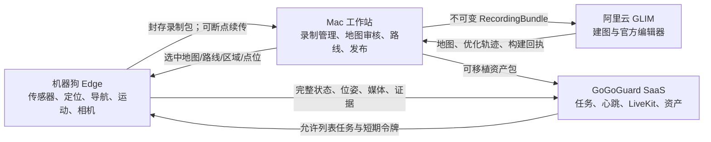
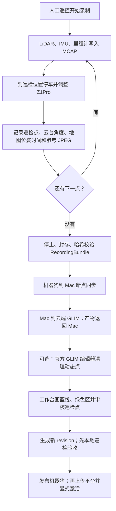

# GoGoGuard 巡检系统：架构与开发者交接总文档

> 更新日期：2026-08-12
>
> 适用仓库：`gogoguard_robot_inspection_v2_field`
>
> 阅读对象：产品负责人、接手开发者、现场实施人员和后续 Codex 任务

本文说明这个系统为什么能巡检、每种能力由什么算法和模块提供、数据怎样在机器狗、Mac、云端和平台之间流动，以及接手后应该怎样开发、测试和发布。

本文是架构教材，不是实时部署回执。当前机器狗究竟装了哪个镜像、最近一次现场发生了什么、下一次实验还缺什么，以仓库根目录的 [PROJECT_STATE.md](../PROJECT_STATE.md) 为准。模块的机器可读责任、入口和依赖，以 [generated/repository-index.md](generated/repository-index.md) 为准。

## 1. 先用一句话说清这个产品

GoGoGuard V2 是一套“先把现场制作成可审核资产，再让机器狗在本地自主执行”的巡检系统：

1. 人用遥控器带机器狗走一遍，机器狗录下激光点云、IMU、里程计、相机参考图和巡检点。
2. Mac 把封存录制包送到阿里云 GLIM，得到三维地图和优化后的运动轨迹。
3. 人在 Mac 工作台审核地图，画蓝色巡检路线和绿色允许区域，确认巡检点及参考照片。
4. Mac 把选中的、版本绑定的地图和路线发布给机器狗。
5. 日常巡检时，机器狗在本地完成里程计、地图定位、路线跟随、避障、停车和到点动作，不依赖浏览器持续在线。
6. GoGoGuard 平台负责下发允许的任务和实时音视频协作，但不直接拥有底层运动控制。

目前它是一个已经跑过真实地图和真实路线的“现场调试产品”，不是所有能力都验收完毕的商用品。平地移动基线 V6 已被现场接受；完整巡检点闭环、平台任务激活、可通绕行重复性、平均速度、实时对话音质和上下楼梯仍有待验收或实现。

## 2. 文档权威性和阅读顺序

新开发者按下面顺序读，不要从历史 Markdown 或一条日志反推系统：

1. 本文：理解整体目标、算法、模块、数据和边界。
2. [PROJECT_STATE.md](../PROJECT_STATE.md) 顶部 `New-task handoff`：确认当前代码、机器狗和现场事实。
3. [generated/repository-index.md](generated/repository-index.md)：找到主责模块、入口、输入输出和依赖。
4. 需要修改的 `architecture/modules/<module>.json`：确认该模块明确拥有和明确不拥有的责任。
5. 专题文档：[现场工作台](FIELD_WORKSTATION_GUIDE.md)、[导航编排](navigation-orchestration.md)、[实时音视频](realtime-interaction.md)。

`docs/archive/` 是历史交接和一次性回执，只能用于追溯，不能当作当前部署说明。`docs/evidence/` 保存早期不可变构建证据，也不替代当前状态。

## 3. 系统的四个运行边界

系统是模块化单仓库，但不是“每个模块一个容器”的微服务系统。真正的部署边界只有四个。

| 边界 | 运行环境 | 拥有什么 | 明确不拥有什么 |
|---|---|---|---|
| 机器狗 Edge | Jetson/ARM64；主容器 Ubuntu 22.04 + ROS 2 Humble | 实时传感器、FAST-LIO、固定地图定位、Nav2、避障、运动桥、相机/云台、音视频、巡检点执行和本地证据 | GitHub、云端 SSH、源代码编译、地图人工审核 |
| Mac 工作站 | macOS 原生 Python 进程；浏览器访问 `127.0.0.1:8080` | Git、历史目录、断点传输、地图审核、路线/区域/点位编辑、发布、部署包制作、现场诊断 | ROS 实时运动回路、持续替机器狗定位 |
| 阿里云 GLIM | Ubuntu + ROS 2 Jazzy；固定脚本 | 接收一份封存录制包、运行 GLIM、官方编辑器会话、返回不可变地图产物 | 机器狗 ROS 流量、路线控制、任意最新分支 |
| GoGoGuard SaaS | 外部平台 | 心跳、允许列表命令、任务/巡检点协议、LiveKit Agent、资产接收和展示 | 直接发送 Unitree 速度、替代机器狗安全边界 |



关键原则：Mac、云端或 SaaS 断线，不应把机器狗的里程计和定位清零。断网后的业务策略可以是继续或本地停住，但实时运动链不能依赖浏览器每秒参与。

## 4. 为什么机器狗能够巡检

### 4.1 传感器先告诉系统“周围长什么样”

Livox MID-360S 持续发射激光并返回三维点。它不是一次就“识别出墙、门、汽车和人”，而是产生许多带三维坐标的采样点。IMU 同时提供角速度和加速度。相机提供图像，但当前几何定位主要依赖激光和 IMU，不依赖视觉语义识别。

点云里默认没有“这是墙”“这是人”的业务标签。GLIM 和 VGICP 处理的是几何一致性。建图时的车辆或行人如果被录入，可能成为以后匹配中的动态干扰，因此系统提供官方 GLIM 编辑器进行人工清理；稳定墙体、楼体、路沿等长期结构应尽量保留。

### 4.2 FAST-LIO 告诉系统“从刚才到现在走了多少”

FAST-LIO 融合激光和 IMU，连续输出六自由度局部里程计：平移 x/y/z 和旋转 roll/pitch/yaw。它解决的是短时间连续运动，不知道自己处在厂区地图的哪个绝对位置。

这一层对应 ROS 变换 `odom -> base_link`。它通常平滑、短期可信，但长距离会积累漂移。因此不能只靠它无限走，也不能在地图短时匹配困难时把它丢掉。

### 4.3 GLIM 把一次录制整理成三维地图

GLIM 在云端处理完整录制，优化各帧之间的关系，输出：

- `map.ply`：三维点云地图；
- `map.json`：工作台可消费的地图描述和来源；
- `trajectory-poses.json`：带时间戳、三维位置和四元数朝向的优化轨迹；
- `overview.svg`：工作台概览；
- `glim-build.json`：构建来源和回执。

GLIM 负责把一段数据拼成一致地图，不负责日常路线跟随，也不负责判断某个门能不能进。官方编辑器只编辑地图点云；蓝色路线、绿色允许区和业务巡检点是在 GoGoGuard 工作台编辑的。

### 4.4 固定地图定位告诉系统“我在地图哪里”

日常巡检时，当前 LiDAR 扫描会与已发布地图做 VGICP 几何匹配，得到 `map -> odom`。把它与 FAST-LIO 的 `odom -> base_link` 合成，才得到机器狗在地图中的绝对位置。

当前恢复策略不是“分数够了就相信”：

1. FAST-LIO 提供连续运动预测。
2. VGICP 产生地图位置候选。
3. 候选必须相对最后可信锚点通过平移和旋转跳变检查。
4. 恢复阶段需要连续三帧互相一致，才把候选变成新锚点。
5. 未确认期间定位标记为不可用，导航进入可恢复暂停，不盲目继续。

这个“是否相信匹配”的编排是 GoGoGuard 自己的薄适配层。VGICP 是成熟几何算法，但成熟库不会自动知道本项目可以接受多大的跳变、地图有哪些动态区域、错误匹配后是否应继续走。

### 4.5 导航地图、目标点和 Nav2 告诉系统“接下来怎么走”

蓝色路线表达主任务方向、巡检点顺序和默认终点。绿色区域表达机器狗绝对不能离开的范围，发布时转成 Nav2 Keepout Mask。当前路线是 x/y/yaw 平面路线；地图和定位保留 3D，并不等于路线已经支持自主上下楼。

generation 9 在 Mac 工作台里增加了一张与定位 PCD 分离的二维导航地图。工作台用高度切片隐藏地面和屋顶，把点聚合为小格，去掉孤立噪点，再让人用“刷成不可走 / 擦掉误判占用”做最终复核。人画绿色范围时依然看的是 PCD 俯视图，但保存只会生成 Nav2 的 PGM/YAML，不会改写原始 PCD。

Nav2 的职责分为：

- StaticLayer：承载人已复核的永久墙体、柱子和地图拓扑；
- SmacPlanner2D：从当前可信 `map pose` 到下一个巡检点（或最终终点）计算全局路径；
- 全局和局部障碍层：把现在的人、车和其他临时障碍叠加到静态图上；
- MPPI：跟随 Smac 给出的当前路径，在局部窗口里不断采样速度并丝滑避障；
- Collision Monitor：保留一个半径 0.48 m 的最终近距离圆形边界；
- Unitree 接收端：只检查授权、有限值、硬件范围和 250 ms 指令新鲜度，然后调用 SDK2 `Move` / `StopMove`。

这样 MPPI 不需要站在 7 米宽的墙中间猜墙另一头在哪；Smac 从整张已复核地图上找门洞或缺口，MPPI 只负责把那条路走好。“人走过后自动继续”和“车堵住后重新找路”不会因少量固定重试次数变成永久停机；真没有通路时仍必须保持零速。

## 5. 三种位置和一个路线进度

现场排障时，必须把下面四个量分开：

| 大白话 | 技术量 | 主要来源 | 错了会怎样 |
|---|---|---|---|
| 从启动后相对走了多少 | `odom -> base_link` | FAST-LIO | 短时运动不连续或长期漂移 |
| 在已发布地图的哪里 | `map -> odom` 与 `map pose` | VGICP + 可信恢复 | 整体跳到错误位置，路线和朝向都错 |
| 当前路线走到哪 | route index / progress | 导航运行时 | 续跑点错误或重复走 |
| 巡检点需要看哪里 | checkpoint map yaw + camera yaw/pitch | 录制样本 + GLIM 时间/四元数绑定 | 狗到了点，但机身或镜头看错方向 |

最新 generation 8 的巡检点修复正是把第四项从“运行路线附近猜朝向”改成“录制参考照片时间匹配 GLIM 优化四元数”。机器狗收到的是已经绑定完成的巡检点 yaw；工作站专用的完整优化轨迹不会发布到机器狗。

## 6. 两条主业务流程

### 6.1 首次建档和录制即配置



录制结束不等于立刻对平台生效。地图原件不可变；每次清图、路线、允许区域或巡检点修改都形成新版本。平台上传和平台激活是两个动作，避免未验收资产直接进入正式任务。

### 6.2 日常巡检

1. 机器狗加载 Mac 已发布的选中候选。
2. 持久 supervisor 启动对应地图的固定定位和 Nav2 运行时。
3. 定位必须达到 `usable`，代价地图和运动桥必须健康。
4. 本地工作台或平台只能启动“选中地图 + 选中路线 revision”的任务，不能任意拼接。
5. 导航沿蓝线执行，绿色区和实时障碍约束走法。
6. 定位短时不可信时进入 hold；恢复多帧确认后从剩余路线继续。
7. 到巡检点先获得真实零速度回执，再进入机身/云台观察对齐。
8. 本地模式显示左侧录制参考图和右侧实时图，由操作员继续、重拍或跳过；平台模式按冻结协议等待判定。
9. 完成当前点后只执行剩余路线后缀，不从起点重走。
10. 完成、显式停止或不可恢复故障后释放 Unitree 控制权，并留下结构化证据。

## 7. 巡检点和相机朝向的精确合同

当前产品场景是“一个点主要拍一张指定方向照片”，不是每点原地 360° 扫描。执行优先级是：

1. 先让 Z1Pro 云台覆盖目标方向；
2. 云台硬范围不够时，机身只补最小必要角度；
3. 再用云台完成剩余方向；
4. 定位或云台反馈未收敛时不伪造成功。

generation 8 的绑定和执行规则：

- 云端产物必须包含 `gogoguard.optimized_trajectory.v1`；
- 每条姿态包含递增时间戳、有限 x/y/z 和有效四元数；
- 录制巡检点 `captured_at` 必须在 0.5 秒内匹配一条优化姿态；
- 有巡检点的地图缺少优化轨迹时，巡检点审核和发布失败关闭；
- 历史上没有巡检点的旧地图仍可准备，避免不必要地破坏既有路线；
- Z1Pro `0x10` 控制以最多 40 Hz、最多 3 秒发送角度；它是混合坐标系：左右使用相对载体 Z 轴反馈，上下/横滚使用绝对欧拉 pitch/roll 反馈。巡检点三轴误差需在 2° 内连续 3 次才算收敛；页面人工 1° 微调使用 0.5° 到位门槛，避免在未运动时就被 2° 业务容差误判为成功；
- TCP 接收按协议头声明长度精确组帧，不能假设一次 `recv()` 就收到一整帧；
- 目标角、实际角、误差、地图位姿和结果都写入事件证据。

这套合同将“录制时看到的方向”“地图优化后的方向”和“执行时机身/相机命令”分开，避免把 route tangent 当成照片朝向。

## 8. 模块总览

代码模块是责任边界，不等于独立进程。跨模块共享数据放在 `modules/contracts`；一个模块不得直接导入另一个模块的内部实现。

### 8.1 `contracts`

- 责任：所有跨模块、持久化和对外消息的稳定模型与校验。
- 主要内容：`RecordingBundle`、`MapJob`、`IncidentBundle`、`MissionPlan`、`MissionStatus`、`NavigationStopReceipt`、`InspectionFrame`、交互状态和平台消息。
- 运行端：机器狗、Mac、云端。
- 不负责：业务状态机、网络请求、硬件和算法。
- 修改规则：字段变更必须考虑旧持久化数据、平台冻结协议和版本兼容。

### 8.2 `calibration`

- 责任：唯一权威的 `base_link -> lidar_link` 外参和 LiDAR/IMU 内参关系。
- 主要入口：`gogoguard-mount-tf`。
- 输入：机器人、传感器身份和版本化标定文件。
- 输出：ROS TF 与标定校验结果。
- 不负责：在线定位调参或自动推断安装角度。

### 8.3 `device_io`

- 责任：Livox、IMU、Z1Pro、BOYA、Go2 扬声器、Unitree SDK2 的硬件边界。
- 主要入口：设备 gateway、相机 gateway、`Z1ProGimbal`、电池 observer、MediaMTX、Unitree UDP receiver。
- 输入：原始硬件流、最终安全速度、音视频帧。
- 输出：标准化传感器状态、WebRTC 媒体、云台收敛结果、真实电量、`Move/StopMove`。
- 不负责：路线、巡检任务、导航决策或平台业务。

### 8.4 `data_capture`

- 责任：开始/停止录制、封存 MCAP、记录巡检点和参考照片。
- 输入：点云、IMU、里程计、Z1Pro 角度、地图位姿时间、JPEG。
- 输出：带清单和哈希的不可变 `RecordingBundle`。
- 不负责：建图算法、路线生成和云端上传策略。

### 8.5 `transfer`

- 责任：机器狗、Mac 之间的不可变文件传输、分块恢复、哈希校验和原子替换。
- 输入：封存录制包、云端地图、工作台导航 workspace。
- 输出：已验证 Mac 录制、机器狗地图版本、可替换路线/点位 revision。
- 不负责：解释地图内容或决定选中哪个版本。

### 8.6 `map_factory`

- 责任：Mac 到云端 GLIM 的作业编排、产物合同校验、官方编辑器会话和新地图版本注册。
- 输入：已封存 `RecordingBundle`。
- 输出：`MapJob`、PLY、JSON、SVG、构建回执和优化轨迹。
- 不负责：画路线、执行导航和实时定位。
- 特别边界：云端返回的文件集合、时间单调性、数值有限性和四元数必须在进入目录前验证。

### 8.7 `route`

- 责任：地图绑定路线、绿色允许区、巡检点审核、候选生成和 workspace 版本。
- 输入：GLIM 地图/优化轨迹、录制样本、操作员编辑的蓝线和绿区。
- 输出：`go2.route.v1`、Nav2 Keepout Mask、运行参数、巡检点和可移植平台包。
- 不负责：控制机器狗或决定导航恢复。
- 兼容规则：旧的无巡检点地图可以没有 `trajectory-poses.json`；一旦有巡检点则必须有严格有效的优化轨迹。

### 8.8 `localization`

- 责任：FAST-LIO 局部里程计和相对一张固定 GLIM 地图的持续 VGICP 定位。
- 输入：LiDAR、IMU、标定、选中地图 PCD。
- 输出：`/Odometry`、`map -> odom`、`/localization/pose`、质量和 `usable`。
- 不负责：路线、障碍业务策略或巡检点动作。
- 当前原则：只处理最新待匹配点云；错误单帧不得改写可信锚点；恢复需要多帧确认。

### 8.9 `navigation`

- 责任：运行选中路线，拥有 Nav2/MPPI、Smac 绕行、定位 hold、真实停止回执、路线后缀续跑和故障分类。
- 输入：蓝线、绿区、地图位姿、局部障碍、版本绑定 MissionPlan 和点位资产。
- 输出：候选速度、运行进度、停车回执、对齐请求、绕行和诊断证据。
- 不负责：直接访问平台、保存地图或实现媒体编码。
- 运行所有权：一个持久 supervisor 是唯一 Nav2 进程所有者，网页只是客户端。

### 8.10 `inspection`

- 责任：巡检点相机帧、图像校验、哈希和有界离线证据队列。
- 输入：观察计划、JPEG/PNG、地图位姿和定位质量。
- 输出：`InspectionFrame` 和动作结果。
- 不负责：机身导航、平台任务判定或图像 AI 算法。
- 当前状态：合同和缓冲已实现，完整平台证据接收仍待验收。

### 8.11 `mission`

- 责任：纯任务状态机，编排“走一段—真停—观察—等待判定—继续”。
- 输入：`MissionPlan`、路线进度、停车回执、检查结果、继续请求。
- 输出：`MissionStatus`、暂停/检查/恢复请求和任务结果。
- 不负责：定位数学、Nav2 参数和平台 HTTP。
- 重要原则：本地操作员模式与平台模式互斥，不能同时抢同一任务。

### 8.12 `evidence`

- 责任：追加式事件、环形事故窗口、不可变回执和同步回放。
- 输入：模块事件、ROS 诊断、地图位姿、速度链、代价地图摘要。
- 输出：JSONL、`IncidentBundle`、MCAP 证据和回放预览。
- 不负责：因为“证据不健康”而禁止机器狗走；证据只解释，不决策。

### 8.13 `interaction`

- 责任：LiveKit 实时会话、BOYA 麦克风、Z1Pro 视频、Go2 播放、唤醒/人设、半双工防回声和播放中断。
- 输入：`start_live/stop_live`、短期 JWT、Agent 音频、冻结 DataChannel 消息。
- 输出：`robot-microphone`、`z1pro-camera`、本地扬声器音频、交互状态和最新位姿包。
- 不负责：任何运动命令；远程操控不是当前产品能力。
- 实现位置：模块状态机在 `modules/interaction`，运行服务在 `services/interaction_edge`。

### 8.14 `platform_edge`

- 责任：完整心跳、允许列表命令、选中巡检生命周期、位姿流和巡检点冻结协议适配。
- 输入：只读导航/交互/电池状态、平台心跳回复、Mission 消息。
- 输出：心跳、命令结果、10 Hz 最新位姿、点位事件和去重后的控制文件。
- 不负责：直接构造任意路线、直接调用 Unitree 或替平台伪造 live 状态。
- 安全边界：只有加入 LiveKit 且轨道发布成功后才能报告 `live`；令牌不得写日志。

### 8.15 `site_console`

- 责任：机器狗和 Mac 共用的窄 HTTP API、前端资源、操作回执和诊断视图。
- 输入：各模块公开状态和操作接口。
- 输出：浏览器页面、地图/路线编辑、录制/导航/点位控制、诊断和只读平台状态。
- 不负责：持有 Nav2 子进程或把网页重启变成定位重启。

### 8.16 `field_workstation`

- 责任：Mac 上的完整现场流程、历史目录、云作业、地图审核、发布、平台资产上传和机器人发布包。
- 输入：机器狗 Edge API、云端 GLIM、平台资产 API、不可变事故包。
- 输出：`127.0.0.1:8080` 工作台、地图/路线 revision、部署包和可验证交接资料。
- 不负责：实时 ROS 或机器狗运动。
- 实现位置：`apps/field_workstation` 和 `deployment/workstation`。

## 9. 关键数据和文件生命周期

### 9.1 不可变资产

以下资产生成后只能产生新版本，不能原地偷偷覆盖：

- 封存后的 `RecordingBundle` 和 MCAP；
- GLIM 原始地图产物；
- 官方编辑器导出的子地图版本；
- 已发布的平台资产包；
- 事故包和部署回执。

### 9.2 可编辑但必须版本化的 workspace

`NavigationWorkspace` 与地图原件相邻，保存：

- 蓝色 route；
- 绿色 allowed area；
- 参数 profile；
- 巡检点绑定和参考图；
- 当前 revision 与来源哈希。

每次保存都生成新 revision。发布时把原地图哈希和 workspace revision 一起绑定，避免“地图没变但路线悄悄换了”。

### 9.3 候选和平台包

机器狗候选包含运行必须的 PCD、路线、Keepout Mask、参数和点位资产。`trajectory-poses.json` 是 Mac/云端绑定材料，不进入机器狗候选。

平台包用于展示地图、路线、狗的实时位置和点位标记。上传成功不自动激活；本地验收后再由明确动作激活。

### 9.4 运行数据不进入 Git

下面目录已在 `.gitignore` 中，不能作为源码推送：

- `workstation-data/`：真实地图、录制、路线 revision、平台包和现场历史；
- `runtime-data/`：测试和事故分析数据；
- `release-cache/`：Docker 镜像导出和部署包；
- `*.log`、虚拟环境、编译缓存。

Git 只保存代码、配置模板、合同、测试和不含密钥的文档。

## 10. 机器狗进程组成

主容器入口 `deployment/container/edge-entrypoint` 按职责启动：

1. MediaMTX：Z1Pro RTSP 到 WebRTC/本地媒体网关。
2. 可选 `interaction-edge`：LiveKit 音视频；默认开关控制。
3. Livox ROS 2 driver：发布点云和 IMU。
4. 标定 TF publisher：发布安装外参。
5. calibrated cloud transformer：生成 body frame 点云。
6. FAST-LIO：发布局部里程计。
7. battery observer：单独在 ROS domain 0 读取 Unitree lowstate。
8. navigation observer：整理只读导航状态。
9. incident recorder：有界被动证据，不参与控制。
10. navigation supervisor：唯一持久 Nav2/定位/运动子进程所有者，提供 Unix socket。
11. 可选 platform heartbeat：允许列表命令和完整状态上报。
12. 可选 pose stream：复用 LiveKit DataChannel 发布最新地图位姿。
13. site console：机器狗窄 HTTP API，默认 8080。

supervisor 根据选中候选动态启动/停止固定地图定位、Nav2、巡检运行时和 Unitree 速度接收器。容器任一必需进程异常退出时，入口会终止同组进程并释放资源，避免留下重复 Nav2 或占用 UDP 5005 的孤儿进程。

## 11. 接口层次

### 11.1 浏览器/工作站 HTTP

`apps/site_console/backend/gogoguard_site_console/server.py` 是端点总入口。主要分组：

- `/api/v1/status|live|camera|gimbal`：设备和实时预览；
- `/api/v1/sessions/...`：录制、巡检点、封存和建图；
- `/api/v1/map-jobs/...`：地图历史、workspace、GLIM 编辑器、平台包/上传；
- `/api/v1/navigation/...`：prepare、runtime start/stop/recover、定位 reset、patrol、checkpoint control；
- `/api/v1/incidents/...`：事故同步、查看和回放；
- `/api/v1/interaction|platform|capabilities`：只读对接状态。

写操作返回可追踪回执。前端显示“执行中”时不应重复点击。

### 11.2 机器狗内部 Unix socket

- navigation supervisor socket：进程生命周期、选中路线启动/停止和状态；
- interaction control socket：LiveKit 会话开始/停止和可靠消息；
- platform adapter 只通过这些窄接口调用，不直接 import 导航或交互内部实现。

### 11.3 平台网络

- 心跳、命令结果和资产上传当前现场配置走平台给出的 HTTP IP 临时入口；
- LiveKit URL 必须使用 `start_live.params.url`，禁止写死域名或端口；
- JWT 只在内存中短期使用，错误回执和日志必须递归脱敏；
- 平台协议冻结字段只能做向后兼容扩展。

## 12. 配置、凭据和环境差异

| 位置 | 用途 | 能否包含密钥 |
|---|---|---|
| `config/default.json` | 产品默认主题、相机和云台合同 | 否 |
| `config/robot/*` | Livox、MediaMTX、交互硬件/人设、检查能力 | 否；只放非秘密设备参数 |
| `config/workstation.json` | 当前现场 robot/cloud/platform 地址 | 否；它是现场配置，不是通用生产默认 |
| `/etc/gogoguard/runtime.env` | 机器狗运行密钥和开关；权限 0600 | 是 |
| 工作站进程环境 | `GOGOGUARD_DEVICE_TOKEN` 等短期凭据 | 是；不持久化到 Markdown |
| LiveKit command params | 60 分钟左右的会话 JWT | 只在内存；不得落日志 |

当前 `config/workstation.json` 含现场 IP 和临时不安全 HTTP 开关。这些不是密码，但接手者不能把它理解成通用生产网络方案。域名备案/TLS 恢复后应通过环境配置切换，而不是修改业务代码。

## 13. 安全控制应该留什么

安全层不是用来掩盖算法缺陷的，但以下边界必须保留：

- 手柄人工停止；
- Mac/平台显式停止；
- 250 ms 指令看门狗；
- 非有限值、越过授权范围或硬件上限的命令拒绝；
- 0.48 m 最终近距离碰撞圆；
- 定位不可用期间禁止盲走；
- 任务和地图 revision 不匹配时拒绝启动。

以下情况不应被实现成“尝试几次后永久停死”：

- 行人短时横穿；
- 障碍消失后的代价地图恢复；
- 单次 MPPI 失败；
- 可恢复定位 hold；
- 证据写入短时失败。

合理行为是：保持零速度、持续更新环境或定位、恢复后从剩余路线继续。若道路真实封死或定位长期不可恢复，才进入需要操作员处理的终态。

## 14. 故障定义：先找第一个失效模块

| 现象 | 首先检查 | 常见根因 | 不要直接归因 |
|---|---|---|---|
| 狗实际没动，地图位置跳几米 | FAST-LIO 位移与 VGICP map pose 对比 | 错误固定地图匹配被接受 | Nav2 障碍、安全圈 |
| 有人经过后不继续 | 障碍层时间线、代价地图、controller 和定位 | 障碍残留、控制失败、定位 hold 或真实封路 | 笼统称“安全门太多” |
| 还没开始巡检就停止 | supervisor generation、候选 revision、定位/代价图 readiness | 旧进程、路线不匹配、启动门禁 | 现场障碍 |
| 到点后方向不对 | checkpoint 录制时间、GLIM 四元数、机身/云台 target/actual | 朝向绑定或执行收敛错误 | route tangent |
| 云台显示调整但没到位 | TCP 帧、目标/实际角、超时、硬范围 | 分包读取、GCU 反馈、范围不足 | 默认重定位 |
| 平台显示 live 但看不到轨道 | LiveKit participant/track 实际状态 | 状态机过早上报、ICE、TURN | 只看自报心跳 |
| 音频越来越卡 | source/output RMS、队列、网络 candidate、TURN | 队列积压、链路抖动、播放阻塞 | 单纯把音量调大 |
| 地图发布失败 | workspace 权限、完整产物、轨迹合同、mask 健康 | 文件权限、缺文件、非单调轨迹、代价图未就绪 | 重复点击前端按钮 |

每次现场问题应保留同一时间轴上的 LiDAR/里程计、定位、导航状态、速度链、代价地图摘要、云台实际反馈和操作回执。没有对应 IncidentBundle 时，只能记录现象，不能把猜测升级为根因。

## 15. 测试、证据和“完成”的等级

任何能力必须准确标注以下等级：

1. **代码存在**：不能代表能运行。
2. **离线单元测试通过**：合同和逻辑在模拟输入下成立。
3. **组合/容器检查通过**：入口、依赖和镜像合同成立。
4. **已构建**：有明确 Git commit、镜像 tag 和 digest。
5. **已安装**：文件/镜像进入机器狗，但未必启动。
6. **已静态启动**：进程、设备和状态健康，未授权运动。
7. **真实现场验证**：明确场景、时间和证据通过。
8. **产品验收**：按重复性口径通过，而不是“偶尔走完一次”。

仓库最低交接检查：

```bash
python3 -m unittest discover -s tests -v
python3 -m compileall -q modules apps services
make ui-smoke
make container-validate
make knowledge-check
git diff --check
```

ARM64 镜像构建需要 Docker 和正确 buildx 环境；未实际构建时必须明确写“容器合同通过，镜像未构建”。

移动底座建议验收：同一地图路线连续 3 次走完；定位短时 hold 能自动恢复；行人离开后自动继续；可通障碍完成绕行和蓝线重入；真实封路理由正确；显式停止能从所有状态释放；平均速度按统一口径测量。

## 16. 构建与发布为什么有两个 Dockerfile

两个 Dockerfile 都是有效资产，不能把其中一个当作“之前那版”删除：

- `deployment/container/Dockerfile`：从锁定依赖和 `third_party/locked_stack` 重建完整 ROS 2 Humble/ARM64 能力。它是可复现能力来源和合同检查对象。
- `deployment/container/Dockerfile.combined`：继承现场接受的内容寻址 V6 基础镜像，只叠加当前 Python、交互和受控导航文件，避免无意重编 Livox、FAST-LIO、Nav2、VGICP 和 Unitree 二进制。当前联合现场发布走这条路径。

正确发布链：

1. Mac 在明确 Git commit 上运行全部检查。
2. 用 ARM64 buildx 构建带唯一 tag 的镜像，记录 manifest/config digest。
3. `deployment/workstation/prepare-robot-release` 导出镜像、校验文件和配置模板到忽略的 `release-cache/`。
4. 通过 Mac 把不可变发布包传到机器狗临时 staging。
5. 机器狗 `install-release` 先校验 SHA-256、加载镜像、安装 systemd 文件；安装本身不自动启动。
6. 在明确授权、机器狗安全姿态下静态启动并检查；运动测试另行授权。
7. 只有真实回执完成后才更新 `PROJECT_STATE.md` 的已部署 digest 和现场结果。

机器狗永远不 `git pull`、不从 GitHub 编译；云端 worker 也不拉任意最新分支。

## 17. 仓库结构和为什么某些“旧代码”必须保留

```text
architecture/modules/    每个模块的机器可读责任清单
modules/                 核心产品模块
services/                map_factory、interaction_edge、platform_edge 运行适配
apps/                    共用现场 UI 和 Mac 工作站组合
deployment/              cloud/container/robot/workstation 发布脚本
config/                  无密钥的产品与现场配置
contracts/               外部合同材料
dependencies/            冻结能力来源锁
third_party/locked_stack/可复现的既有 ROS/硬件能力快照
tests/                   单元和纵向组合回归
tools/                   UI、容器和知识索引检查
docs/                    当前文档、专题、生成索引和历史归档
```

不要仅凭名称里有 `legacy` 就删除：

- `evidence/legacy.py` 等读取器用于打开已经存在的现场证据；
- profile/contract 的迁移分支用于兼容磁盘上旧配置；
- `third_party/locked_stack` 是锁定能力来源，不是另一套正在运行的旧应用；
- 两个 Dockerfile 分别承担“完整可重建”和“冻结基线增量发布”；
- Git 历史已经保存淘汰源代码，活跃树中不应再放一个复制的 `old/` 应用目录。

一次性交接文档已经移入 `docs/archive/2026-08-handoffs/`。运行数据和镜像缓存留在忽略目录，不需要为了 GitHub 手工删除，也绝不能提交。

## 18. 当前部署事实与本地待发布差异

截至本文更新：

- 现场接受的移动底座仍是 V6；generation 8 镜像继承该内容寻址基础，没有改变定位、Nav2/MPPI、避障、速度或 0.48 m 安全圆。
- generation 8 的巡检点、云台与平台闭环能力仍由当前镜像继承；它曾以 commit `1c81255` 独立部署，完整历史 digest 见 `PROJECT_STATE.md`。
- generation 9 增加可审核静态导航图、整图 SmacPlanner2D 点目标规划和导航地图工作台。2026-08-13 已把运行代码和 `map-62d8cec9a1dc` generation-9 静态导航候选安装到机器狗，并在定位、Nav2、运动桥全停止时通过静态检查；尚无真实巡检或绕障运动验收。现场操作见 [NAVIGATION_MAP_EDITOR_GUIDE.md](NAVIGATION_MAP_EDITOR_GUIDE.md)。
- revision 6 修正两处巡检点的 GLIM 时间戳/四元数朝向，并增加云台反馈收敛；两处朝向已从机器狗资产文件直接核对，但尚未站立执行物理巡检。
- 本次代码审查加强了云端优化轨迹校验、旧无巡检点地图兼容、巡检点精确录制样本索引、录制线程关闭生命周期和 Z1Pro TCP 分包组帧。机器人相关代码已经部署；新的云端 exporter 仍未发布到 GLIM worker。
- 工作台、平台 token、机器人在线状态会随现场变化；接手者必须重新读取实时状态，不得把本文日期当作在线证明。

## 19. 已知缺口和优先级

### P0：完成已有巡检点闭环

- 构建并部署 generation 8 修复；
- 两个真实巡检点均完成真停、方向收敛、参考/实时对比、拍摄、继续和最终任务完成；
- 验证 Mac 本地模式和平台模式不会争抢；
- 再上传/激活 revision 6。

### P1：把移动底座从“能跑”变成“可重复”

- 同路线连续 3 次；
- 可通障碍绕行和蓝线重入；
- 动态行人离开后恢复；
- 完整 retained trace；
- 统一平均速度口径并继续达到约 0.6 m/s 产品目标。

### P1：实时交互验收

- 音量 10 + 3 倍受限增益的主观听感；
- 小玖唤醒后有明确、及时、可听的确认；
- 网络差时不积压到越来越卡；
- 视频、真实电量、完整心跳和巡检并发；
- TLS/备案恢复后的正式入口切换。

### P2：平台产品闭环

- 资产展示、路线/实时位置、点位管理；
- MissionPlan 下发和 checkpoint evidence 接收；
- 报告聚合、断网缓存和重传策略；
- 低电量返航仍未实现，不能在 capability 中伪报支持。

### P3：楼梯

当前系统只有 3D 地图/定位基础，没有自主楼梯路线执行。路线 V1 会丢弃 z，Nav2 是 2D 平面规划，运动桥只用 `Move(vx, vy, vyaw)`。

未来应设计路线 V2：保留 xyz、楼层、平地/上楼/下楼/平台段、入口/出口姿态；任务调度器在平地 Nav2 执行器和独立楼梯执行器之间切换，且任一时刻只有一个运动所有者。先验证当前 Go2 型号和授权能否调用厂商楼梯步态，再决定是否需要更大的地形感知和足式控制项目。

## 20. 新开发者的标准工作方式

1. 从 `PROJECT_STATE.md` 顶部确认当前状态和禁止事项。
2. 说明问题的第一个失效能力，选一个主责模块。
3. 读生成索引和该模块 manifest，只追必要依赖。
4. 先写或补能复现问题的测试，再修改实现。
5. 跨模块只改公开合同，不互相 import 内部代码。
6. 若状态、入口、依赖、合同或来源改变，更新模块 manifest 并运行 `make knowledge`。
7. 运行与风险相称的完整检查；UI 和容器改动有额外检查。
8. 提交一个有意图、可审查的 commit，不混入运行数据和无关格式化。
9. 代码通过不等于已部署；部署和运动需要用户在当前任务明确授权。
10. 现场验证后把 commit、digest、场景、证据和结论写入 `PROJECT_STATE.md`。

常见改动路由：

| 需求或故障 | 主责模块 | 可能的合同协作 |
|---|---|---|
| 点云/IMU 不到、相机或云台异常 | `device_io` | `calibration`、`evidence` |
| 录制或断点下载失败 | `data_capture` / `transfer` | `contracts`、`field_workstation` |
| GLIM 产物或编辑器失败 | `map_factory` | `transfer`、`field_workstation` |
| 蓝线、绿区、点位绑定错误 | `route` | `map_factory`、`contracts` |
| 地图位置跳变或重定位不了 | `localization` | `evidence`、`navigation` 只消费状态 |
| 沿线速度、避障、绕行、停止 | `navigation` | `device_io` 最终执行、`evidence` |
| 到点相机和照片证据 | `inspection` | `device_io`、`mission` |
| 任务暂停/继续/点位状态 | `mission` | `navigation`、`inspection` |
| 心跳、平台命令和资产协议 | `platform_edge` / `field_workstation` | `contracts` |
| 音视频、唤醒、扬声器 | `interaction` | `device_io`、`platform_edge` |
| 页面显示或按钮反馈 | `site_console` | 对应后端模块公开接口 |

## 21. GitHub 交接清单

推送前由仓库所有者完成：

- 确认 `git status` 只含本次有意修改；
- 确认没有 token、密码、私钥、录制、地图、日志、镜像 tar；
- 运行第 15 节全部检查；
- 阅读本次 diff，特别检查部署脚本和安全边界；
- 将工作提交到短期集成分支，不直接让机器狗跟踪分支；
- 推送后开一个 draft PR，PR 描述写清代码状态、未部署状态和下一项现场验收；
- 让接手者先读本文和 `PROJECT_STATE.md`，再读具体模块；
- 不把 `docs/archive/` 的历史结论复制进新 PR 当作当前事实。

## 22. 最后再用大白话复述一次

机器狗能走，是 Unitree 接受了本地速度；知道自己刚才走了多少，是 FAST-LIO；知道自己在厂区哪里，是当前点云和 GLIM 固定地图做 VGICP 匹配；知道要去哪，是蓝色路线；知道哪里绝不能去，是绿色区域；看到临时人车并绕开，是 Nav2 代价地图、MPPI 和 Smac；到点看对方向，是录制照片时间、GLIM 优化朝向、机身和 Z1Pro 共同完成；平台只是给任务、看状态和做实时协作，不能越过这些模块直接驱动机器狗。

系统真正的难点不是某一个算法名字，而是让每一层只做自己的事，并且在错误时能够明确回答：最先错的是传感器、里程计、地图定位、路线、避障、运动、相机、平台，还是部署状态。这个仓库的模块化、版本化资产和证据链，就是为了让后续开发始终能回答这个问题。
